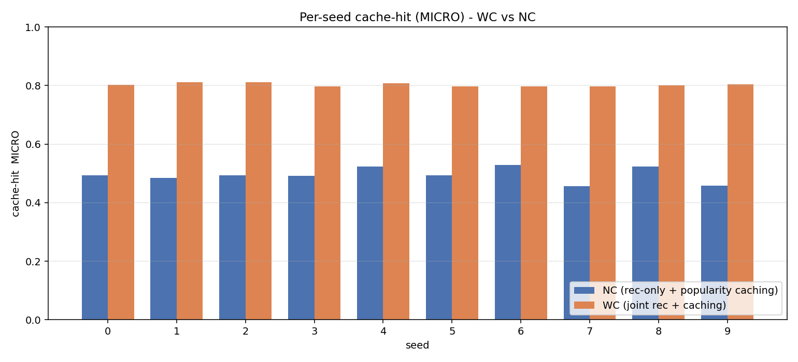

# Joint content recommendation and edge caching with deep RL

A post-graduation re-implementation of the single-edge problem from my diploma thesis
(Alogoskoufis, 2025), with a redesigned Q-network (`DQNFlex`) and a faster training
pipeline. The numbers below come from this code, not from the thesis. One Double DQN agent
(dueling heads, NoisyNet exploration, 3-step returns, prioritised replay) decides, at
every step of a user session, which item to recommend next and whether to put the item the
user just watched into a small edge cache. The question is whether learning both decisions
together (agent `WC`) beats a recommendation-only agent that leaves caching to a
popularity heuristic (agent `NC`). Everything runs in a user simulator built from
MovieLens ratings.

## Related

- **Thesis as submitted** — [*Optimizing Network-friendly Recommendations and Caching jointly,
  using Reinforcement Learning*](https://github.com/AlogoskoufisAlexandros/thesis-network-friendly-recommendations-caching-rl)
  (TU Crete, 2025; original notebook and PDF): the starting point; this repository
  supersedes its single-edge code.
- **Multi-cache extension** (several cooperating edge caches, built on this code): in
  preparation; it will be added to this repository as a sibling folder.

## Result

Setup: MovieLens, 5 000 items, cache of 10, cache kept across user sessions, 10 seeds,
20 000 training and 10 000 evaluation episodes per run. The metric is the cache-hit
rate over the evaluation episodes, total hits / total steps. A hit means the item the
user watches next was already in the cache.

| Agent | Hit rate, mean ± std over 10 seeds |
|---|---|
| non-RL baseline: recommend the most similar item, cache by popularity | 0.094 ± 0.003 |
| non-RL greedy: recommend the most similar *cached* item, cache by popularity | 0.317 ± 0.049 |
| NC: recommendation-only Double DQN, popularity caching | 0.495 ± 0.025 |
| NC + PBRS: NC with WC's reward shaping (control) | 0.479 ± 0.098 |
| WC: joint recommendation and caching Double DQN | 0.803 ± 0.006 |

WC beats NC in all 10 seeds by 30.8 points on average (paired t-test p < 1e-4, Wilcoxon p = 0.002).



Per-seed numbers for all five agents: [docs/RESULTS.md](docs/RESULTS.md), section 0, or
`results/all_agents_per_seed.csv`.

About the control row. WC and NC differ in two ways: the action space, and a small
potential-based shaping term in WC's reward. NC + PBRS is NC with the same shaping term.
It ends up where plain NC does, 32 points below WC in 10 of 10 seeds, so the gap is due
to the action space and not to the shaping. I also checked that NC is not simply
under-explored: the NoisyNet noise is still there when NC stops improving, and the policy
it settles on is already the best a recommendation-only agent can do under this user
model. The reason is structural. Only 594 of the 5 000 items have any recommendation the
simulated user would follow, and those items form small groups that cannot be reached
from each other. WC's cache moves with the user into whatever group they are in; a
popularity cache stays where it is. Numbers, per-seed values and file references are in
[docs/RESULTS.md](docs/RESULTS.md).

## Install

```bash
pip install -r requirements.txt --extra-index-url https://download.pytorch.org/whl/cu121
pip install jupyter        # only needed to open the notebook
```

Python 3.11, PyTorch 2.5.1 with CUDA 12.1 (the versions the results were produced with).
It also runs on CPU, slowly. One training run needs about 2 GB of RAM; the model itself
is small, so several runs can share one GPU.

## Data

Download MovieLens 25M from https://grouplens.org/datasets/movielens/25m/ and put
`ratings.csv` in this folder (`single-edge-rl-joint-rec-caching/`). It is not included here (GroupLens' terms, and it
is about 680 MB). The first run builds the two inputs the simulator uses, the
item-similarity matrix `u` and the popularity vector, and saves them as `.npy` files.
To try the code without any download, set `DATASET_KIND = 'synthetic'` in the notebook's
config cell. Details in [docs/DATA.md](docs/DATA.md).

## Reproduce

Run everything from this folder (`cd single-edge-rl-joint-rec-caching`). `run_seed_sweep.py` executes the notebook's
definition cells and runs one (agent, seed) per process, several at a time. Finished
runs are skipped if you launch again. `--collect` builds the tables and compares them
with the shipped results.

```bash
# wiring check: all three agents, seed 0, 250 episodes
python run_seed_sweep.py --smoke

# headline table: WC and NC, 10 seeds each (a multi-day job on one GPU)
python run_seed_sweep.py --launch --jobs WC:0-9,NC:0-9 --parallel 2

# control: NC + PBRS, 10 seeds
python run_seed_sweep.py --launch --jobs NCPBRS:0-9 --parallel 2

# tables and paired statistics for whatever has finished
python run_seed_sweep.py --collect
```

Expected values: WC about 0.80, NC about 0.50, NC + PBRS about 0.48. Runs are seeded
end to end; . See [docs/REPRODUCE.md](docs/REPRODUCE.md).

## Contents

```
single_edge_rl.ipynb           simulator, agents, network, replay buffer, train(), single-run cells
run_seed_sweep.py              runs the notebook's code as parallel processes; one command per result
results/headline_WC_vs_NC/     the 10-seed WC vs NC sweep (per-seed CSV, protocol, training curves)
results/control_NC_PBRS/       the NC + PBRS control and the WC reproduction check
docs/figures/                  figures used in this file and in docs/RESULTS.md
docs/                          ARCHITECTURE.md, RESULTS.md, REPRODUCE.md, DATA.md
```

The notebook is one linear file: imports, data utilities, `Environment` (the user and
cache simulator), the tabular agents carried over from the thesis (kept, not
used for the results), the `DQNFlex` network, replay buffers, `DQNAgent` with its
subclasses `DQNAgent_NC`, `DQNAgent_NC_PBRS` and `DQNAgent_WC`, `train()`, the non-RL
baselines, the config cell, and the single-run cells. [docs/ARCHITECTURE.md](docs/ARCHITECTURE.md)
walks through each part.

## Citation and licence

See `CITATION.cff`. MIT licence.
