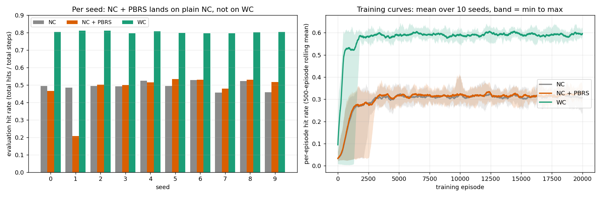
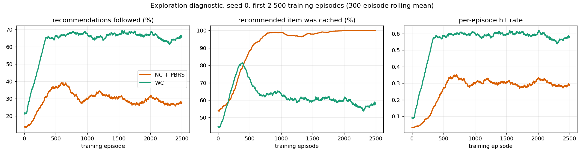

# Results

Every number in sections 1 and 2 comes from a CSV under `results/`. Section 3 summarises
earlier findings that are not reproduced in this repository and says so.

Metric throughout: the pooled cache-hit rate over the evaluation episodes, total hits /
total steps, with a hit counted when the next requested item is in the cache as it was
before the agent acted. Evaluation uses the best training checkpoint.

## 0. All agents, per seed

Hit rate per seed for every agent, joined from the two sweeps below (same environment and
evaluation episodes within a seed). File: `results/all_agents_per_seed.csv`.

| Seed | Baseline | Greedy | NC | NC + PBRS | WC | WC − NC | WC − NC+PBRS |
|---|---|---|---|---|---|---|---|
| 0 | 0.098 | 0.408 | 0.494 | 0.467 | 0.803 | +0.310 | +0.337 |
| 1 | 0.099 | 0.270 | 0.485 | 0.208 | 0.811 | +0.325 | +0.603 |
| 2 | 0.094 | 0.236 | 0.494 | 0.502 | 0.811 | +0.317 | +0.309 |
| 3 | 0.089 | 0.319 | 0.492 | 0.501 | 0.797 | +0.304 | +0.296 |
| 4 | 0.093 | 0.310 | 0.524 | 0.515 | 0.808 | +0.284 | +0.292 |
| 5 | 0.094 | 0.313 | 0.494 | 0.534 | 0.798 | +0.304 | +0.264 |
| 6 | 0.090 | 0.337 | 0.529 | 0.531 | 0.797 | +0.269 | +0.266 |
| 7 | 0.096 | 0.372 | 0.456 | 0.480 | 0.797 | +0.341 | +0.317 |
| 8 | 0.095 | 0.289 | 0.523 | 0.531 | 0.802 | +0.278 | +0.271 |
| 9 | 0.090 | 0.313 | 0.458 | 0.517 | 0.805 | +0.347 | +0.288 |
| **mean ± std** | 0.094 ± 0.003 | 0.317 ± 0.049 | 0.495 ± 0.025 | 0.479 ± 0.098 | 0.803 ± 0.006 | +0.308 ± 0.026 | +0.324 ± 0.101 |

WC wins every seed against both NC and NC + PBRS. Details, protocol and tests follow.

## 1. WC vs NC, MovieLens, persistent cache, 10 seeds

Protocol: `single_edge_rl.ipynb` with `DATASET_KIND = 'movielens'`, N = 5000,
K = 10, `corr_threshold` = 0.6, `prob_leave` = 0.05, 20 000 training and 10 000
evaluation episodes, seeds 0 to 9. Within a seed all agents see the same environment and
the same evaluation episodes.

| Agent | Hit rate (mean ± std) | Per-episode mean | Seeds won by WC |
|---|---|---|---|
| Non-RL baseline | 0.094 ± 0.003 | 0.077 | |
| Non-RL greedy | 0.317 ± 0.049 | 0.197 | |
| NC (`DQNAgent_NC`) | 0.495 ± 0.025 | 0.314 | |
| WC (`DQNAgent_WC`) | 0.803 ± 0.006 | 0.595 | 10/10 |
| WC minus NC, paired | +0.308 ± 0.026 | +0.280 | |

Wilcoxon signed-rank p = 0.0020; paired t-test p < 0.0001.

File: `results/headline_WC_vs_NC/seed_sweep_results.csv`. Produced by
`run_seed_sweep.py --launch --jobs WC:0-9,NC:0-9`.

## 2. Control: NC with WC's reward shaping

WC and plain NC differ in two ways at once: the action space, and the potential-based
shaping term in WC's reward (see ARCHITECTURE.md, section 5). To separate the two,
`DQNAgent_NC_PBRS` adds the identical shaping term to NC and changes nothing else. If the
shaping were what makes WC learn, NC + PBRS should approach WC.

Protocol: identical to section 1, same seeds, same environment and evaluation episodes
per seed. Run with `run_seed_sweep.py --launch --jobs NCPBRS:0-9`.

| Agent | Hit rate (mean ± std, n = 10) | WC minus this, paired |
|---|---|---|
| NC (section 1) | 0.495 ± 0.025 | +0.308 ± 0.026, 10/10 |
| NC + PBRS | 0.479 ± 0.098 | +0.324 ± 0.101, 10/10, paired t p = 3.1e-6, Wilcoxon p = 0.002 |
| WC (section 1) | 0.803 ± 0.006 | |

Per seed, NC + PBRS: 0.467, 0.208, 0.502, 0.501, 0.515, 0.535, 0.531, 0.480, 0.531,
0.517 (seeds 0 to 9). NC + PBRS minus NC is -1.6 points, not significant. Seed 1 is an
outlier (0.208): its training-phase hit rate was a normal 0.461 but the checkpoint was
taken at episode 3 500 on a noise peak. Without it the mean is 0.509, still where plain
NC is.

The training curves of NC + PBRS and NC are indistinguishable: both sit at a per-episode
hit rate of 0.30 to 0.35 from episode 2 000 to 20 000, while WC sits at 0.58 to 0.63.

Reproduction check: WC seed 7 was re-run through `run_seed_sweep.py` and gave the same
value as the shipped sweep, 0.7968983, with the checkpoint at the same episode.

Conclusion: the shaping does not move NC. WC and NC + PBRS differ only in the action
space, so that is where the 30-point gap comes from.

Files: `results/control_NC_PBRS/seed_sweep_results.csv` (paired table), `all_runs.csv`
(per-run rows with runtime and memory), `runs/*_history.npz` (training curves),
`seed_sweep_meta.json` (protocol).

### Is NC under-trained rather than limited?

NC's training curve is flat from about episode 1 300 on, long before the learning-rate
peak of the OneCycle schedule at episode 6 000. So it is fair to ask whether NC could do
better with more exploration. Three checks say no; the diagnostic scripts and their raw output are not shipped, the
figure below summarises them.

Exploration does not fade. I re-ran seed 0 of both agents for 2 500 episodes logging the
NoisyNet noise scale, which the sweep does not save. The mean |sigma| of the noisy layers
goes from 0.051 to 0.043 for NC + PBRS and to 0.040 for WC, so it is at more than 80% of
its initial value well after NC's policy has settled. NoisyNet is the only exploration
mechanism (`eps_value = 0`).

The settled policy is the right one for NC. NC + PBRS converges to recommending a cached
item 100% of the time, with 27% of recommendations followed. The user follows a
recommendation only if `u[current, item] > 0.6`, and otherwise draws the next item from
popularity regardless of what was recommended. So an unfollowable cached recommendation
costs nothing and a followable cached one is a sure hit. There is no better action for
the noise to find.

The gap has a structural cause. Only 594 of the 5 000 items have any recommendation the
user would follow, and the graph of followable recommendations splits into small strongly
connected components, the largest with 19 items. A recommendation chain can only stay
inside one component. WC caches the items of whichever component the user lands in and
then hits on every step of the chain; NC's popularity cache, whose counts never decay,
settles on roughly one component and cannot follow the user elsewhere. For a fixed cache
of 10 items I computed the exact optimal recommendation policy by value iteration over
the 5 000 items and searched over cache sets: the best fixed cache found reaches 0.42
(value iteration over a fixed cache). Trained NC reaches 0.49, above that, because its cache
adapts slowly over the run. That is what an agent at its ceiling looks like.

Not done: an exact ceiling for NC with its adaptive cache rule, and a run with an
epsilon-greedy floor (which the analysis above predicts would change nothing).

## 3. Earlier findings under per-session cache reset (context, not shipped)

Before the persistent-cache protocol, the environment emptied the cache at the start of
every session. Under that protocol trained WC and NC were within about one point of each
other in every configuration I tried: a sweep over `corr_threshold`, `cache_size` and
`prob_leave` on MovieLens, and a test on KuaiRec data with a negative correlation between
item similarity and popularity (WC minus NC = +0.44 points). With the cache reset every
session, hits come from steering within the session, which a recommendation-only agent
learns as well; keeping the cache across sessions is what lets cache decisions compound.

Two caveats. No files of record for these numbers are included; they come from my
research notes and are only here to explain why the protocol changed. And two things
changed on the same day the persistent protocol was introduced: the cache semantics, and a
rebuild of `u` and `popularity` from the raw ratings after a data-loading bug was found.
The comparison in section 1 is unaffected (both agents use the rebuilt inputs), but "reset
gives no gap, persistence gives 30 points" has not been re-tested with both protocols on
the same inputs.

One methodological point from that period applies everywhere: report the pooled hit rate
(total hits / total steps) and say so. The mean of per-episode rates is several points
lower on the same policy, and an apparent gap in an early analysis turned out to be a
mismatch between the two.

## Files

| File | Contents |
|---|---|
| `results/headline_WC_vs_NC/seed_sweep_results.csv` | Section 1, per seed. Alongside: `seed_sweep_aggregate.json`, `seed_sweep_meta.json`, and every run's training curve in `seed_sweep_curves.npz` |
| `results/control_NC_PBRS/seed_sweep_results.csv` | Section 2, per seed, paired with the section 1 values, plus the WC seed 7 re-run. Alongside: `all_runs.csv`, `runs/*_history.npz`, `seed_sweep_meta.json` |
| `results/all_agents_per_seed.csv` | Section 0: the two sweeps joined into one per-seed table; derived, adds nothing new |
| `run_seed_sweep.py` | Produces any of the above from the notebook's cells |

`seed_sweep_curves.npz` holds the headline training curves under keys `{seed}_{NC|WC}_curve`
and `{seed}_{NC|WC}_loss`; the control stores one `runs/<tag>_history.npz` per run plus a
one-row `runs/<tag>.csv` with runtime and peak memory, merged in `all_runs.csv`.
`seed_sweep_meta.json` records the protocol (environment, reward, optimiser, scheduler,
checkpoint rule, metric, seeds, episode budgets, software versions).

Lineage: the shipped runs were executed from my working notebooks, which is why the
`seed_sweep_meta.json` files name them (`done.ipynb`, `done_seedsweep.ipynb`) and carry
their md5s rather than the release notebook's. `single_edge_rl.ipynb` is that code with
outputs cleared and the headline configuration; re-running WC seed 7 through the release
driver reproduces the shipped 0.7968983 exactly.

## Open

- WC without the shaping term: not run. It would show whether WC needs the shaping to
  learn, not whether NC can match WC.
- Reset versus persistent cache with both protocols on the same inputs (section 3).
- Whether the component structure behind the gap is specific to MovieLens. The persistent
  result exists on MovieLens only.
- The 5- and 6-feature state variants are in the notebook but were not compared with the
  7-feature one at this scale.
